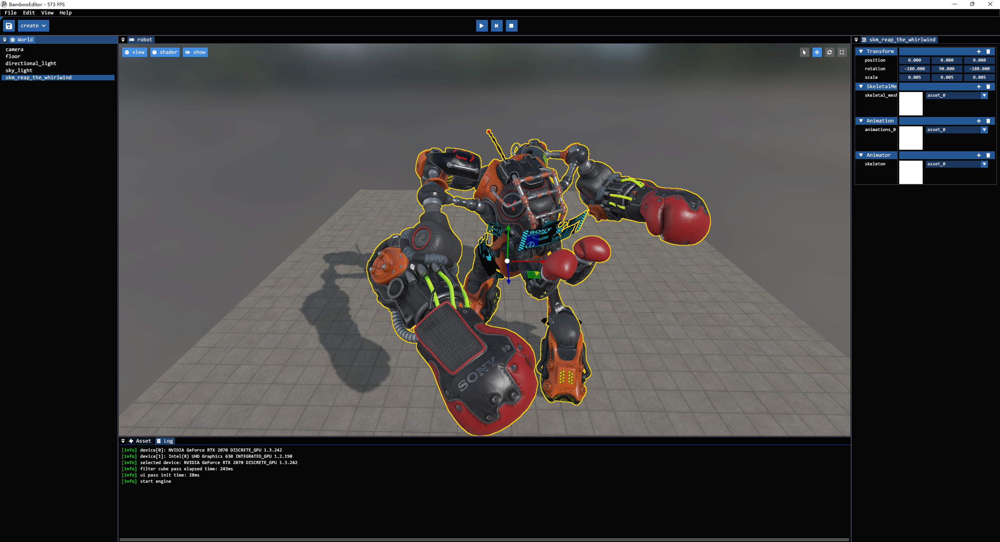
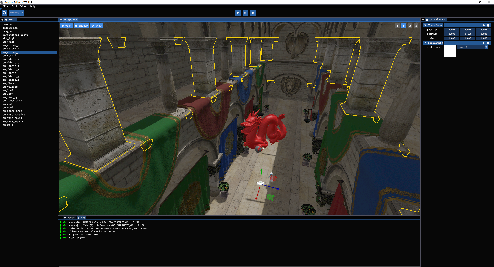
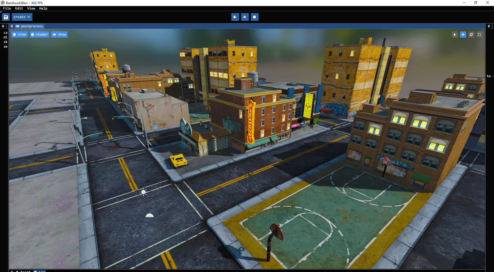
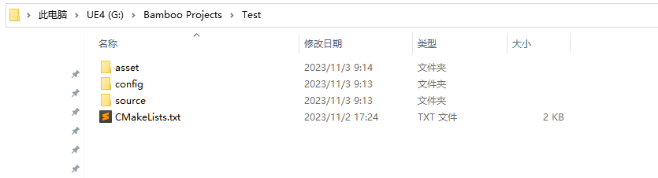
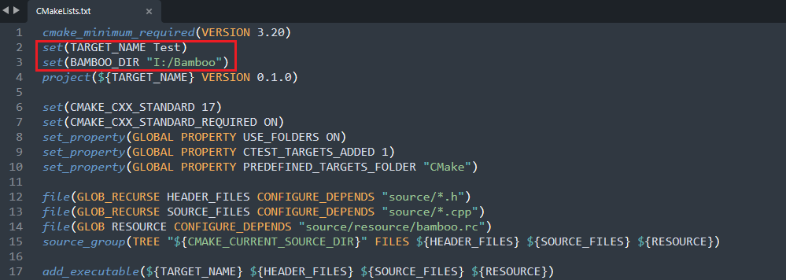

# YURRGOHT_ENGINE

## What is Yurrgoht?
**Yurrgoht** is a lightweight game engine with high-fidelity graphics rendering and simulation functions, provides a flexible gameplay framework. Yurrgoht uses vulkan as the only graphics/computing api, linux based, and is written in C++17. Dockerfile is included for easy replication of development environment

- This project was forked from the Bamboo game engine project by RobotBerry https://github.com/Code-Guy/Bamboo  
- Assets for testing: https://github.com/SaschaWillems/Vulkan

<!-- 




 
-->

## Features
- UE-like Editor
- Static/Skeletal mesh rendering
- Asset System
- Pixel-perfect picking and outlining
- 3D translation/rotation/scale gizmos
- Reflection and serialization system
- Physically-Based Rendering
- Deferred and forward mixing rendering paths
- Multiple light types(Directional/Sky/Point/Spot)
- Postprocessing(Color Grading)
- Play in Editor(PIE)
- Physics System
- Texture Compression
- Engine/Editor/Game code isolation


## TBD Features
- Tick editor
- Simple scripting language for easy programming and does not need to be compiled
- Convert from using glfw to sdl2
- Audio system with steam audio
- Asynchronous input
- Virtual Texturing and sparse bindings for envoirnments
- Increase preformance with further optimization of systems
- Simple multiplayer features (TBD)
- Better in-depth documentation


<!-- 
## How to build
**I just wanna give it a try**

Well, if you're using Windows, you can download the prebuild package(Release.zip) in the latest release page:)
-->

**Supported Platforms**
- Linux
- Windows(WIP)
- MacOS(TODO)

**Prerequites**
- [Git](http://git-scm.com/downloads).
- [CMake](https://cmake.org/download/). Version 3.20.0 or later is required.
- [Docker](https://www.docker.com/). For development environment.

**Step 1.** Clone the Yurrgoht repository. Now the engine and editor modules will be compiled to two static libraries rather than one engine library and one editor executable.

```shell
git clone https://github.com/michaeljhkim/Yurrgoht.git
```

**Step 2.** Download the lastest version's Project.zip file, unzip to somewhere. It's a demo project which relies on the engine and editor sources to compile, and contains "asset" "config" "source" and "CMakeLists.txt" four items.
<!--  -->

**Step 3.** Open "CMakeLists.txt" file, modify TARGET_NAME property to whatever you want, and modify Yurrgoht_DIR to the absolute path of where you put Yurrgoht repository. **(That's very important!)**
<!--  -->

**Step 4.** Go to Project folder, use CMake to generate build files using any [desired generator](https://cmake.org/cmake/help/latest/manual/cmake-generators.7.html). The generating command maybe like this:

```shell
cmake -G Ninja -S . -B build
```

**Step 5.** Then you can use any IDE according to you selected generator, but you can also just build straight from CMake.

```shell
cmake --build build --config Release
```


**TEMP INSTRUCTIONS** Here for reference, but will make cleaner once I get everything else at the very least functional

```shell
docker build -t yurrgoht/testapp:1.0 .
cmake -G Ninja -S . -B build
cmake --build build --config Release

cd build/source
./Test
```


## External libraries
All external libraries' source codes have been included in the dockerfile, so no further installation will be required :)

- [vma](https://gpuopen.com/vulkan-memory-allocator/)(vulkan resource management)
- [glm](https://glm.g-truc.net/0.9.9/)(math)
- [glfw](https://www.glfw.org/)(window and input)
- [imgui](https://www.dearimgui.com/)(gui)
- [spdlog](https://github.com/gabime/spdlog)(logging)
- [yaml-cpp](https://github.com/jbeder/yaml-cpp)(config)
- [tinygltf](https://github.com/syoyo/tinygltf)(model loading)
- [ktx](https://github.com/KhronosGroup/KTX-Software)(texture compression and loading)
- [cereal](https://uscilab.github.io/cereal/)(serialization)
- [json](https://www.json.org/json-en.html)(required by cereal)
- [rttr](https://www.rttr.org/)(reflection)
- [eventpp](https://github.com/wqking/eventpp)(event system)
- [jolt](https://github.com/jrouwe/JoltPhysics)(physics system)